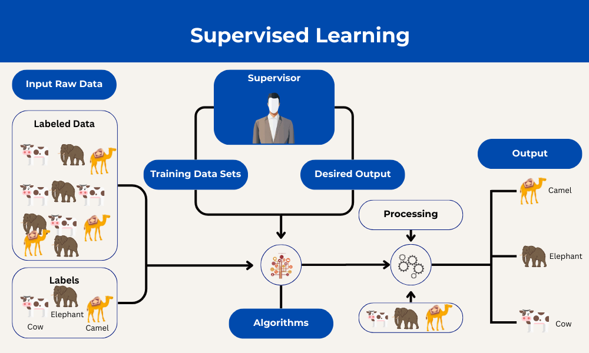
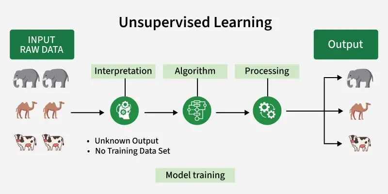

### Question 1:Define Machine Learning using a real-life example.?

### Answer:Machine Learning (ML):Enables the systems to learn from data, identify patterns, and make decisions.
### Example:Learning: The ML algorithm identifies patterns, such as frequent phrases ("free money," "urgent action"),suspicious links, or sender information.

### Question 2 : Compare Supervised Learning and Unsupervised Learning, giving an example of each?.

### Answer:Supervised Learning:Trains algorithms using labeled input-output pairs to map inputs to desired outputs.
  ### Example: Predicting a student’s grade based on study hours.

  - You already know past students’ hours and grades → model learns to predict new students’ grades.

  

  ### Unsupervised-Learning:A type of machine learning where the model is trained on unlabeled data. It is like letting a child explore and learn on their own without a teacher to find hidden patterns or groupings in the data on its own. 
  

  ### Question 3:What causes Overfitting? How can it be prevented?.

  ### Answer:Common Causes of Overfitting.
  - Noisy or Dirty Data
  - Limited Training Data
  - Irrelevant Features

 ### To Prevent Overfitting.
- Dropout: Randomly "turns off" neurons during training in neural networks.
- pruning: Reduces complexity.
- Data Augmentation.

### Question 4 : Explain how training data and test data are split, and why this process is necessary.?

### Answer:In machine learning, splitting data into separate sets is a fundamental step to ensure a model can perform well on new, real-world information rather than just "memorizing" its training examples.

#### Why the Split is Necessary

- To see if the model has actually learned general rules.
- Prevent Overffing
- Keeping a test set separate ensures that the final performance metric is objective and hasn't been influenced by the training or tuning process (a problem known as "data leakage").

### Question 5 :Find one case study (research paper or article) that explains how Machine Learning has been applied in healthcare, business, or transportation. Summarize its findings?

### Case Study:Machine learning in Transportation.
### Case study title: "Machine Learning Applications in Surface Transportation Systems"

## Summary:

### Machine learning is widely used in transportation research — but mostly for predicting traffic conditions. Classical and tree-based methods are common, while newer techniques get little attention. Progress is limited by poor data access and weak bridges between transportation planners and ML researchers. The authors argue that building shared data resources and stronger interdisciplinary collaboration could unlock more impactful applications of machine learning in real transportation systems.

## Impact
### This study shows that machine learning has a significant positive impact on surface transportation systems, particularly in improving the accuracy of traffic flow, speed, and travel time predictions compared to traditional methods.

## References:

https://www.mdpi.com/2076-3417/12/18/9156.
### Mitchell TM. Machine learning. New York: McGraw-Hill; 1997.

