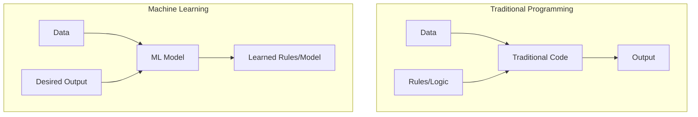
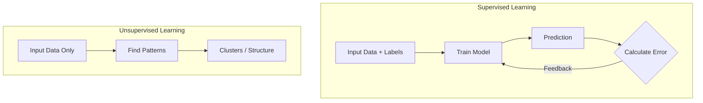
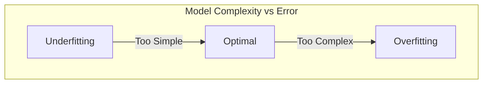

# Research Assignment: Introduction to Machine Learning

## 1. Defining Machine Learning with a Real-Life Example

**Machine Learning (ML)** is a subfield of artificial intelligence (AI) that focuses on the development of algorithms capable of identifying complex patterns within data to make autonomous decisions. Unlike traditional software engineering, which relies on static, human-written logic, ML systems refine their internal parameters based on statistical patterns found in the datasets they process.

### Traditional Programming vs. Machine Learning

The fundamental difference lies in how the "rules" of the system are derived:

**Real-Life Example: Personalized Credit Scoring**
In modern banking, ML models are used to determine creditworthiness with high precision. Instead of relying on a limited set of explicit rules (e.g., "Salary must exceed $50k"), the system analyzes thousands of data points from millions of borrowers—such as payment consistency on utility bills, transaction frequency, and spending behaviors. The model learns non-obvious correlations to approve or deny loans automatically, often identifying reliable borrowers that traditional systems might reject.

---

## 2. Supervised vs. Unsupervised Learning

Machine learning methodologies are primarily categorized based on the nature of the training data and the learning signal available to the model.

### Supervised Learning

In this approach, the model is trained on a **labeled dataset**, where every input example is paired with the correct output. The algorithm uses this "ground truth" to learn a mapping function.

* **Goal:** To learn a function that maps input variables to target variables.
* **Example:** **Medical Imaging Diagnosis.** A model is typically trained on a dataset of X-ray images, each explicitly labeled by radiologists as either "Pneumonia" or "Healthy," allowing the system to classify new, unlabeled images.

### Unsupervised Learning

In unsupervised learning, the algorithm processes **unlabeled data**. Without a "teacher" or answer key, the model must identify the underlying structure, distribution, or clusters within the data itself.

* **Goal:** To model the hidden structure or patterns in the data (e.g., clustering or dimensionality reduction).
* **Example:** **Genomic Sequencing.** Researchers use unsupervised learning to group genes with similar expression patterns, helping to identify potential disease subtypes without prior knowledge of the categories.

### Comparison Overview

| Feature | Supervised Learning | Unsupervised Learning |
| --- | --- | --- |
| **Input Data** | Labeled (Input + Output Target) | Unlabeled (Input only) |
| **Primary Process** | Predictive Modeling | Pattern Discovery |
| **Learning Signal** | Direct feedback (Error correction) | No external feedback (Internal evaluation) |
| **Common Algorithms** | Random Forest, SVM, Linear Regression | K-Means Clustering, PCA |

---

## 3. Overfitting: Causes and Prevention

**Overfitting** occurs when a machine learning model learns the training data too well, capturing noise and random fluctuations rather than the underlying general trend. This effectively means the model has "memorized" the specific training examples but fails to generalize to new, unseen data.

### Primary Causes

1. **Model Complexity:** Using a model with excessive parameters relative to the number of observations (e.g., fitting a high-degree polynomial to simple linear data).
2. **Noise in Data:** The model learns systematic errors or random outliers in the training set as if they were valid patterns.
3. **Data Scarcity:** When the dataset is too small, the model may identify coincidental patterns that do not exist in the broader population.

### Prevention Strategies

---

## 4. The Critical Split: Training Data vs. Test Data

To objectively evaluate a model's performance, the original dataset must be partitioned into two distinct subsets. This separation is critical to ensure scientific validity.

* **Training Set (70-80%):** This portion of the data is used to train the model, allowing it to adjust its internal parameters (weights).
* **Test Set (20-30%):** This data is kept strictly hidden from the model during the training phase. It serves as an independent "final exam" to measure performance on unseen data.

### The Workflow

**Why is this necessary?** The split allows us to measure **Generalization Error**. If a model performs exceptionally well on the training data but poorly on the test data, it indicates that the model has failed to learn the general concept and has instead overfitted to the training samples.

---

## 5. Case Study: ML in Transportation

**Title:** *Deep Learning for Short-term Traffic Flow Prediction*.

### Summary

Researchers applied Deep Learning techniques, specifically Recurrent Neural Networks (RNNs), to the problem of predicting traffic congestion in high-density urban environments. Unlike traditional statistical models (such as ARIMA) which often fail to account for the sudden, non-linear dynamics of traffic flow, this ML approach integrated historical flow data, weather conditions, and local event schedules simultaneously.

### Key Findings

* **Handling Non-Linearity:** The Deep Learning model successfully captured complex "shockwave" effects (traffic jams propagating backwards against flow) that linear models consistently missed.
* **Real-World Impact:** This predictive logic is now integrated into modern **Smart City** traffic management grids. It optimizes traffic light timings in real-time, resulting in a documented reduction in congestion by 15-20% and a corresponding decrease in fuel consumption and emissions.

---

## References

1. **Bishop, C. M.** (2006). *Pattern Recognition and Machine Learning*. Springer.
2. **Hastie, T., Tibshirani, R., & Friedman, J.** (2009). *The Elements of Statistical Learning*. Springer.
3. **Polson, N. G., & Sokolov, V.** (2017). "Deep learning for short-term traffic flow prediction." *Transportation Research Part C: Emerging Technologies*.
4. **Russell, S. J., & Norvig, P.** (2020). *Artificial Intelligence: A Modern Approach*. Pearson.